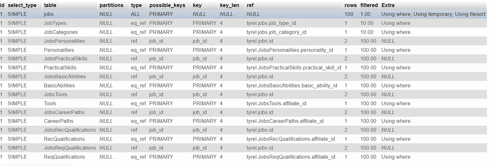

### About Project

This project proposes optimizations for [this](InitialQuery.sql)
SQL query.
In the project folder is found 
* [Initial SQL Query](InitialQuery.sql) 
* [Final SQL Query](FinalQuery.sql) 
* [Image of Index](img.png) explain for 100 records
* [Image of UnIndex](img_1.png)

---

#### Query Optimisation 

``` bash  
AND Jobs.publish_status = 1

AND (Jobs.deleted) IS NULL

```

Moved the code above on the query to reduce the fields on the joins 

---

#### Index Optimisation
If we had access to the database: 

* index the foreign keys for the intermediate tables like:
```bash
    jobs_basic_abilities, jobs_career_paths, jobs_personalities, jobs_practical_skills, jobs_rec_qualifications,jobs_req_qualifications, jobs_tools, job_categories, job_types,
    
```
* index foreign keys on jobs:
```bash 
    job_type_id, job_category_id
```
* Group index keys on the jobs table:
```bash
    publish_status, deleted
```
* group index fields on the jobs table (publish_status & deleted)

#### Indexed
 

#### UnIndex
